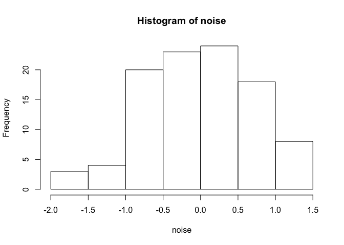

## Simulating the effect of single genetic variant on gene expression

First, let's simulate some genotypes with minor allele frequency (MAF) of 0.5 from 100 individuals. The easiest way to do this is to simulate each allele as an independent bionomial draw from the same binomial distribution and take their sums.

```r
maf = 0.5
sample_size = 100
genotypes = rbinom(n = sample_size, size = 1, prob = maf) + 
  rbinom(n = sample_size, size = 1, prob = maf)
table(genotypes)
```

```
## genotypes
##  0  1  2 
## 19 54 27
```
Since the variance of a single binomial random variable is `np(1-p)` and we are summing together two independent binomial random variables, then their variance should be:

```r
sigma = 1*maf*(1-maf)+1*maf*(1-maf)
sigma
```

```
## [1] 0.5
```

We can confirm this by calculating the sample variance of our simulated genotypes:

```r
var(genotypes)
```

```
## [1] 0.4581818
```

Now, let's simulate measurment noise from a normal distribution with equal variance (0.5):

```r
noise = rnorm(sample_size, mean = 0, sd = sqrt(0.5))
hist(noise)
```

<!-- -->

Finally, we can combine the genotypes with measurement noise to construct our simulated gene expression data:

```r
expression = genotypes + noise

#Standardise by subrtacting mean and dividing by standard deviation
std_expression = (expression-mean(expression))/sd(expression)
```

Standardise genotypes and combine into a single data frame

```r
std_genotype = (genotypes - mean(genotypes))/sd(genotypes)
data = dplyr::data_frame(std_expression = std_expression, 
                         std_genotype = std_genotype, 
                         genotype = genotypes)
```

Visualise the data

```r
ggplot(data, aes(x = factor(genotype), y = std_expression, color = factor(genotype))) + 
  geom_point(position = position_jitter(width = .2)) + 
  theme_light() + 
  xlab("Minor allele count") + 
  ylab("Standardised gene expression")
```

<!-- -->

Fit a linear regression model to the simulated data to estimate genotype effect

```r
#Null hypothesis - no genotype effect
model_h0 = lm(std_expression~1, data = data)
#Alternative hypothesis - genotype has an effect on gene expression
model_h1 = lm(std_expression~std_genotype, data = data)

#Perform likelihood ratio test (LRT) to see if we can reject the null hypothesis
#(This is what Leo explained in the lecture)
lrt_result = anova(model_h0, model_h1, test = "LRT")

#Extract p-value
p_value = lrt_result$`Pr(>Chi)`[2]
p_value
```

```
## [1] 2.188217e-33
```

Estimate the fraction of variance explained by the genotype. Note that since we simulated the genotypes and measurement noise to both have variance of 0.5 (standard deviation of `sqrt(0.5)`), then this value should be close to 0.5, but will obiously vary between random samples.

```r
summary(model_h1)$r.squared
```

```
## [1] 0.5966461
```


